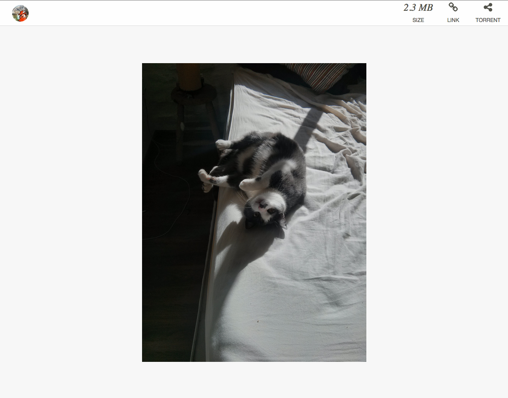

# Dropshare Landing Page

I use [Dropshare](http://getdropsha.re/) because it's awesome, I like to have control over my files and dislike the often-too-expensive subscription rates of the alternatives.

## What this is

Dropshare allows you to use a custom html file as a way to present your drops, it automatically previews images but it does nothing for audio and video files, so I decided to write my own thing.

## Features

This landing page has the following features

* Adds an HTML5 audio player for mp3, ogg and wav files.
* Adds an HTML5 video player for mov, mp4, webm and ogg files.
* Provides a direct link to the file.
* Provides a torrent download for the file, because [it's super easy](http://docs.aws.amazon.com/AmazonS3/latest/dev/S3TorrentRetrieve.html) and why the hell not?

## Stack

It's pretty much plain html + css + javascript. It uses [React.js](http://facebook.github.io/react/) because I kinda wanted to try it, I'm liking it so far.

## Using it

Dropshare takes the file from the `~/Documents/Dropshare-LandingPage.html` so I suggest creating a symbolic link to the file from whever you're keeping the repository.

```bash
$ git clone git@github.com:pote/dropshare-landing.git && cd dropshare-landing
$ ln -s $PWD/Dropshare-LandingPage.html $HOME/Documents/Dropshare-LandingPage.html
```

And you're done!

## Previews

This is what it looks like right now, still lots of work to do though, take a look at the [TODO](./TODO.md) file.




